# 🍽️ MBG Dashboard — Program Makan Bergizi Gratis

Dashboard analitik interaktif untuk Program Makan Bergizi Gratis (MBG) Indonesia periode **2024–2026**.

**Live:** [mbg-indonesia.streamlit.app](https://mbg-indonesia.streamlit.app)

---

## 🖼️ Preview Dashboard

### 📊 Executive Overview

Dashboard utama yang memberikan ringkasan KPI strategis nasional, tren pertumbuhan bulanan, dan komposisi penerima berdasarkan kategori serta status gizi.
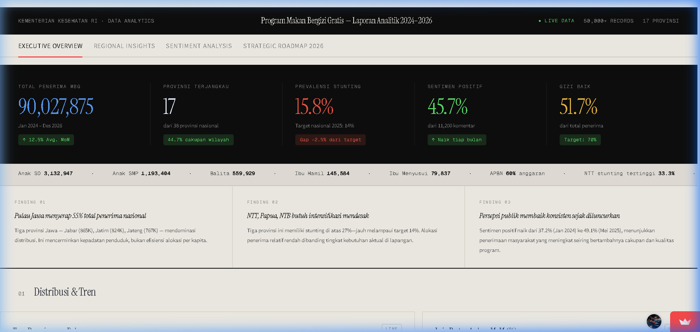
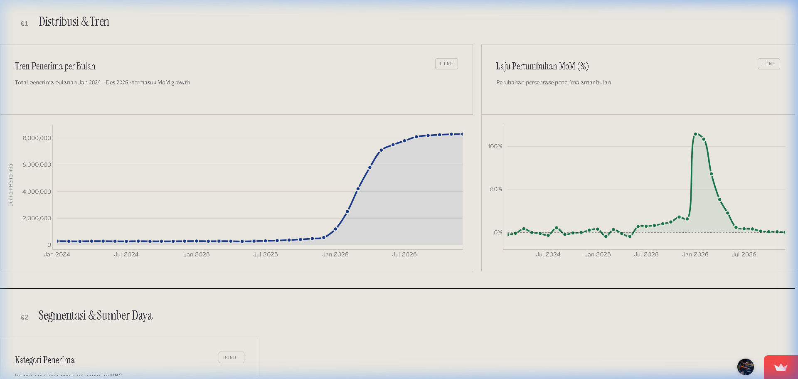
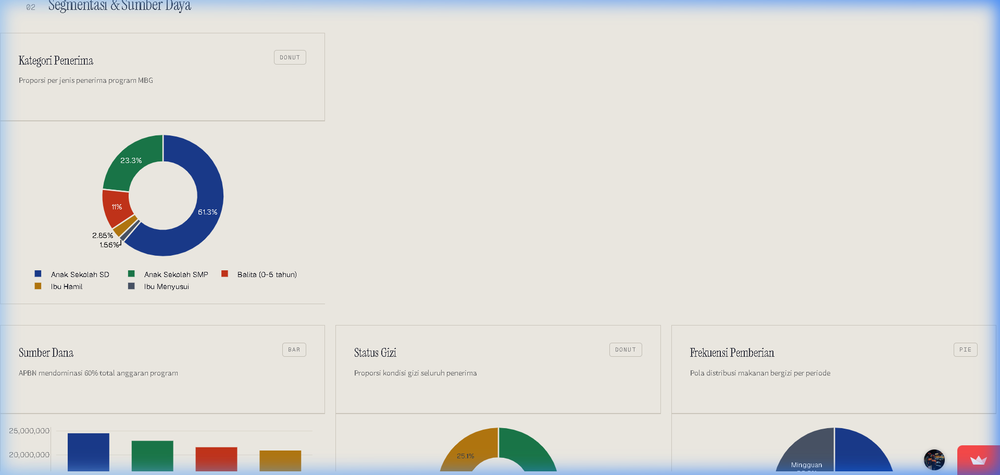

### 🗺️ Regional Insights

Analisis mendalam per provinsi yang mencakup pemetaan stunting, ranking daerah, dan korelasi antara jumlah penerima dengan target prevalensi stunting.
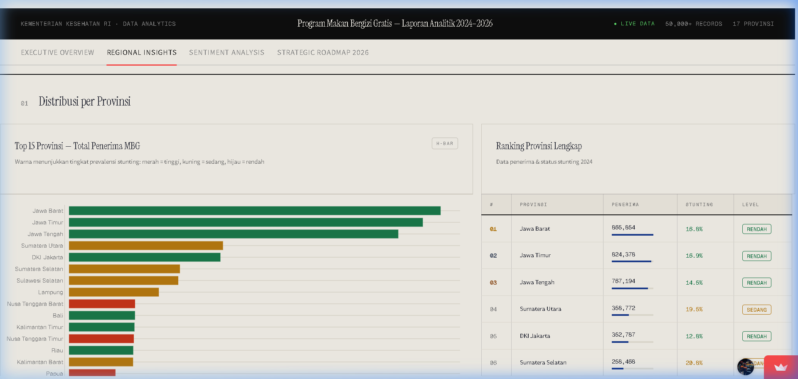
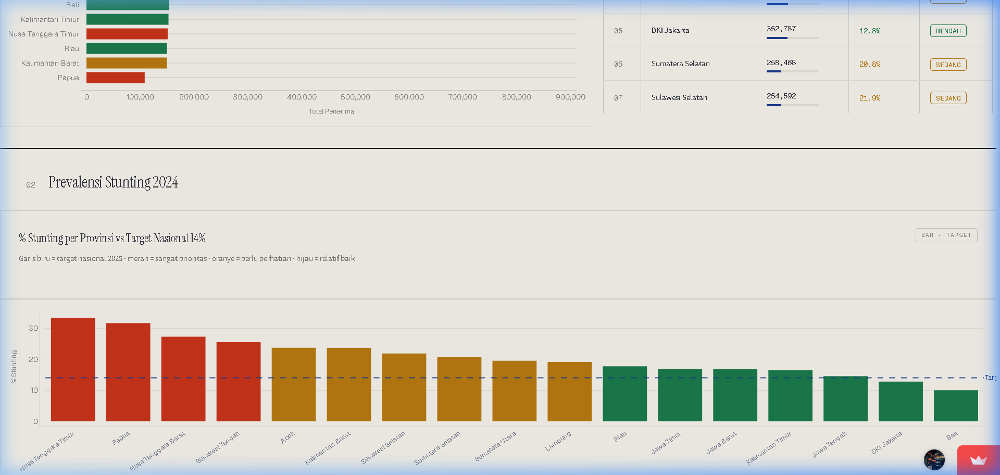
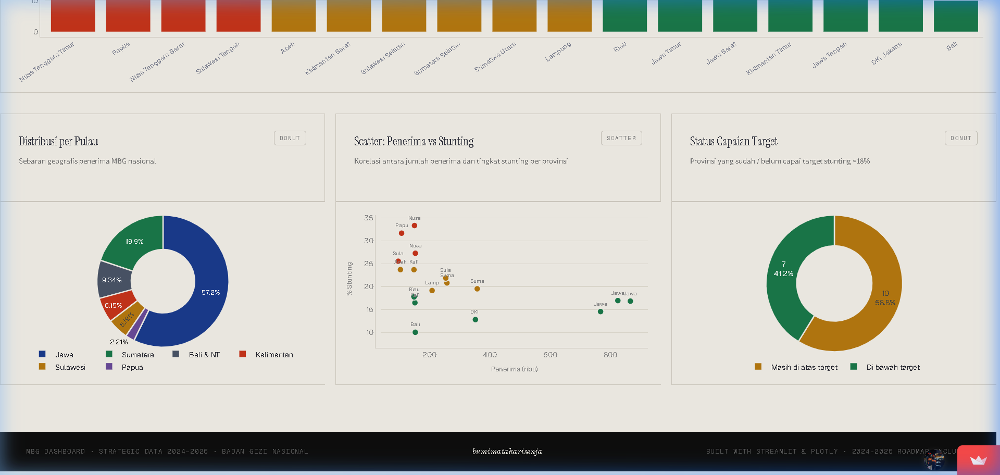

### 🎭 Sentiment Analysis

Monitoring persepsi publik melalui data media sosial dengan visualisasi tren sentimen, distribusi platform, dan topik utama (Word Cloud).
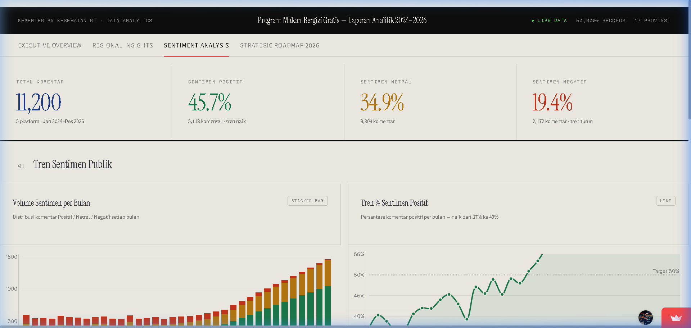
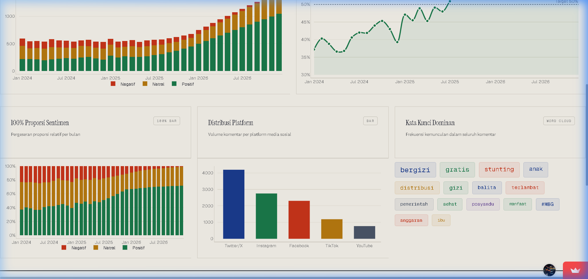
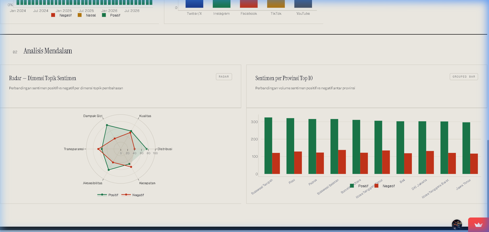

### 🚀 Strategic Roadmap 2026

Visi jangka menengah Program MBG yang merumuskan ekskalasi anggaran, target penerima 82.9 Juta, dan penciptaan lapangan kerja secara masif.
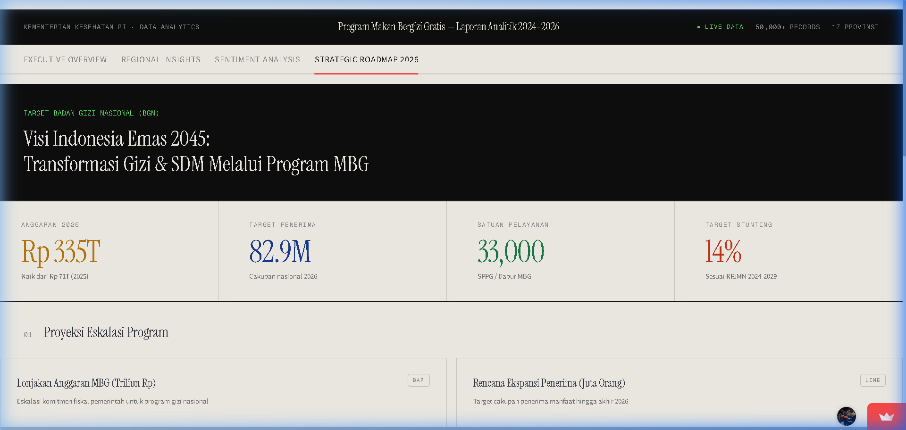
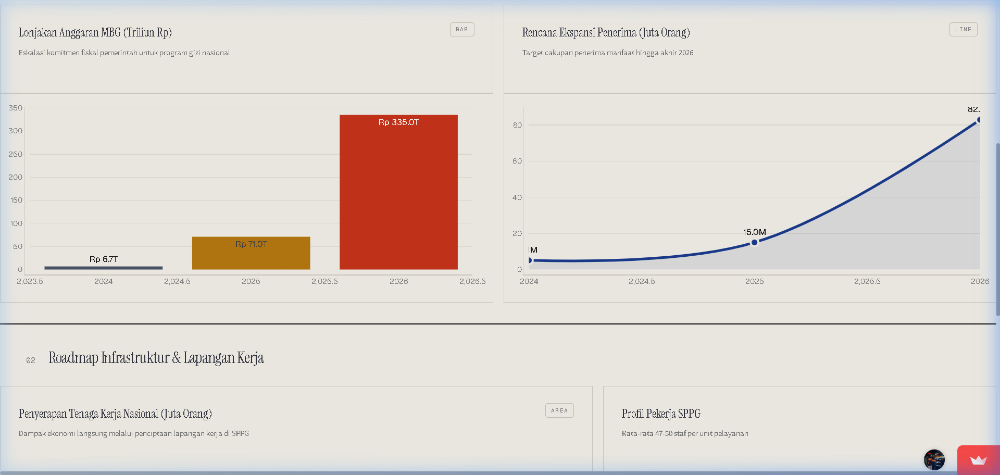
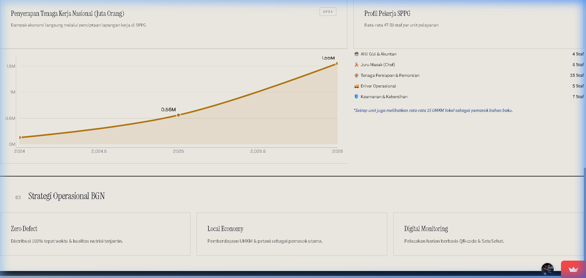

---

## Fitur Utama

### 📊 KPI Strategis

- **Total Penerima (90M+)**: Monitoring real-time distribusi pangan.
- **Prevalensi Stunting**: Target penurunan agresif menuju 14%.
- **Sentimen Positif**: Tracking persepsi publik terhadap implementasi program.

---

## Tech Stack

- **Framework:** Streamlit
- **Visualisasi:** Plotly Express & Graph Objects
- **Pengolahan Data:** Pandas & NumPy
- **Runtime:** Python 3.14 (Optimized for Streamlit Cloud)
- **Tipografi:** Google Fonts (Instrument Serif, Geist, Geist Mono)

---

## Pengembangan Lokal

1. Clone repositori ini
2. Install dependensi:
   ```bash
   pip install -r requirements.txt
   ```
3. Jalankan aplikasi:
   ```bash
   python -m streamlit run app.py
   ```

---

## Deploy ke Streamlit Cloud

1. Push pembaruan kode ke branch `main`.
2. Pastikan file `runtime.txt` berisi `python-3.14`.
3. Gunakan **Advanced Settings** di dashboard Streamlit Cloud untuk memastikan koneksi repositori aktif.

---

_Created by Buminata Research & Development_
